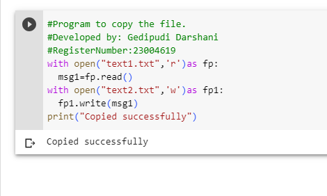

# copy-file
## AIM:
To write a python program for copying the contents from one file to another file.
## EQUIPEMENT'S REQUIRED: 
PC
Anaconda - Python 3.7
## ALGORITHM: 
### Step 1:
Firstly fill the text1.txt and text.txt with words.
### Step 2: 
Give the commands to copy the text from another text.
### Step 3: 
Give the print satement to get the files copied successfully.
### Step 4:  
End the program.

## PROGRAM:
``````
#Program to copy the file.
#Developed by: Gedipudi Darshani
#RegisterNumber:23004619
with open("text1.txt",'r')as fp:
  msg1=fp.read()
with open("text2.txt",'w')as fp1:
  fp1.write(msg1)
print("Copied successfully")
``````
### OUTPUT:


## RESULT:
Thus the program is written to copy the contents from one file to another file.